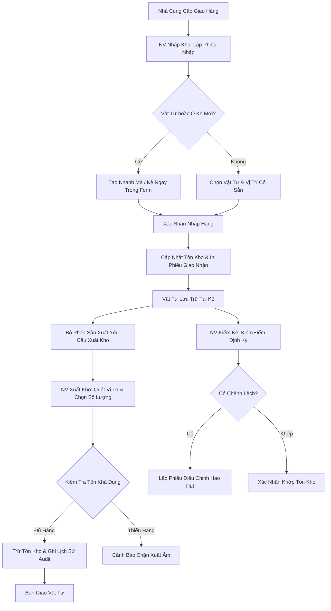

# 📘 TÀI LIỆU ĐẶC TẢ NGHIỆP VỤ & HƯỚNG DẪN SỬ DỤNG HỆ THỐNG
## WMS PRO - INDUSTRIAL WAREHOUSE MANAGEMENT SYSTEM
**Phiên bản:** 1.0.0 | **Tác giả:** Business Analyst (BA) Team | **Đối tượng:** Quản lý Kho, Ban Giám Đốc, Nhân viên Vận hành

---

## 📑 MỤC LỤC
1. [TỔNG QUAN HỆ THỐNG & PHẠM VI ÁP DỤNG](#1-tổng-quan-hệ-thống--phạm-vi-áp-dụng)
2. [MA TRẬN PHÂN QUYỀN & VAI TRÒ NGHIỆP VỤ (RBAC)](#2-ma-trận-phân-quyền--vai-trò-nghiệp-vụ-rbac)
3. [DANH SÁCH TÀI KHOẢN THỰC NGHIỆM (DEMO ACCOUNTS)](#3-danh-sách-tài-khoản-thực-nghiệm-demo-accounts)
4. [QUY TRÌNH NGHIỆP VỤ CHUẨN (STANDARD OPERATING PROCEDURES)](#4-quy-trình-nghiệp-vụ-chuẩn-standard-operating-procedures)
   - [4.1. Quy trình Nhập Kho Đa Mặt Hàng (Inbound / Goods Receipt)](#41-quy-trình-nhập-kho-đa-mặt-hàng-inbound--goods-receipt)
   - [4.2. Quy trình Xuất Kho & Kiểm Soát Chống Xuất Âm (Outbound)](#42-quy-trình-xuất-kho--kiểm-soát-chống-xuất-âm-outbound)
   - [4.3. Quy trình Kiểm Kê & Cân Đối Hao Hụt (Audit & Adjustment)](#43-quy-trình-kiểm-kê--cân-đối-hao-hụt-audit--adjustment)
   - [4.4. Quy trình Quản Lý Định Mức Tồn Kho An Toàn (Safety Stock Alert)](#44-quy-trình-quản-lý-định-mức-tồn-kho-an-toàn-safety-stock-alert)
5. [HƯỚNG DẪN THAO TÁC CHI TIẾT TỪNG PHÂN HỆ GIAO DIỆN](#5-hướng-dẫn-thao-tác-chi-tiết-từng-phân-hệ-giao-diện)
   - [5.1. Bảng Điều Khiển Tổng Quan (Dashboard)](#51-bảng-điều-khiển-tổng-quan-dashboard)
   - [5.2. Quản Lý Phiếu Nhập Kho & In Phiếu Chuẩn](#52-quản-lý-phiếu-nhập-kho--in-phiếu-chuẩn)
   - [5.3. Xuất Vật Tư Nhanh (Mobile-First Flow)](#53-xuất-vật-tư-nhanh-mobile-first-flow)
   - [5.4. Sơ Đồ Vị Trí Ô Kệ (Visual Location Mapping)](#54-sơ-đồ-vị-trí-ô-kệ-visual-location-mapping)
   - [5.5. Tra Cứu Tồn Kho Đa Tiêu Chí](#55-tra-cứu-tồn-kho-đa-tiêu-chí)
   - [5.6. Nhật Ký Biến Động Toàn Hệ Thống (Audit Trail)](#56-nhật-ký-biến-động-toàn-hệ-thống-audit-trail)
   - [5.7. Quản Trị Tài Khoản & Phân Quyền Người Dùng](#57-quản-trị-tài-khoản--phân-quyền-người-dùng)
6. [KỊCH BẢN DEMO TRÌNH DIỄN DÀNH CHO LÃNH ĐẠO (EXECUTIVE DEMO SCRIPT)](#6-kịch-bản-demo-trình-diễn-dành-cho-lãnh-đạo-executive-demo-script)
7. [TÍNH NĂNG KỸ THUẬT & AN TOÀN DỮ LIỆU](#7-tính-năng-kỹ-thuật--an-toàn-dữ-liệu)

---

## 1. TỔNG QUAN HỆ THỐNG & PHẠM VI ÁP DỤNG

### 1.1. Bối cảnh & Mục tiêu dự án
Hệ thống **WMS Pro (Warehouse Management System)** được thiết kế chuyên biệt cho việc quản lý vật tư kỹ thuật, linh kiện kim khí, thiết bị điện, hóa chất phụ trợ và dây chuyền tự động hóa trong các nhà máy và kho bãi công nghiệp.

Hệ thống giải quyết triệt để 4 bài toán trọng tâm:
1. **Minh bạch hóa dòng chảy hàng hóa**: Mọi giao dịch (Nhập, Xuất, Điều chỉnh) đều có dấu vết định danh người thực hiện, thời gian thực và vị trí ô kệ chính xác.
2. **Cắt giảm 80% thời gian nhập hàng**: Cho phép tạo nhanh mã vật tư mới và vị trí kệ mới trực tiếp ngay trong quá trình nhập hàng (on-the-fly) mà không cần chuyển màn hình.
3. **Triệt tiêu sai sót & Chống xuất âm**: Thuật toán kiểm soát kho nghiêm ngặt (Atomic DB Transaction) bảo đảm số lượng tồn kho khả dụng luôn chính xác.
4. **Hỗ trợ đa nền tảng**: Tối ưu hiển thị cho máy tính để bàn (Desktop Management) và thiết bị di động/máy tính bảng cầm tay (Mobile Field Work).

---

## 2. MA TRẬN PHÂN QUYỀN & VAI TRÒ NGHIỆP VỤ (RBAC)

Hệ thống thiết lập cơ chế Phân quyền theo vai trò (Role-Based Access Control) chặt chẽ với **6 nhóm người dùng**:

| Nhóm Vai Trò | Mã Role | Trách Nhiệm Nghiệp Vụ Chính | Quyền Hạn Đặc Thù |
| :--- | :--- | :--- | :--- |
| **Quản Trị Viên** | `ADMIN` | Quản trị hệ thống, cấp phát tài khoản, phân quyền, sao lưu. | Toàn quyền cấu hình (CRUD Users, Master Data, Override). |
| **Quản Lý Kho** | `MANAGER` | Giám sát KPI kho, duyệt phiếu nhập kho, theo dõi báo cáo tồn kho & biến động. | Xem Dashboard toàn quyền, duyệt/hủy phiếu nhập, xem toàn bộ báo cáo. |
| **NV Nhập Kho** | `INBOUND_STAFF` | Tiếp nhận hàng từ nhà cung cấp, kiểm đếm, tạo phiếu nhập, phân bổ vào kệ, in phiếu nhập. | Lập phiếu nhập kho, tạo nhanh Mã/Kệ mới, in phiếu nhập. |
| **NV Xuất Kho** | `OUTBOUND_STAFF` | Xuất cấp phát vật tư theo yêu cầu sản xuất hoặc bảo trì thiết bị. | Thực hiện lệnh xuất kho tại kệ, xem tồn khả dụng. |
| **NV Kiểm Kê** | `AUDITOR` | Kiểm đếm định kỳ, so sánh tồn sổ sách và thực tế, lập phiếu cân đối hao hụt. | Thực hiện giao dịch điều chỉnh (Adjustment), xem nhật ký kiểm toán. |
| **NV Kho Tổng Hợp**| `WAREHOUSE_STAFF`| Nhân viên đa nhiệm vận hành tại hiện trường kho. | Thực hiện các thao tác nhập/xuất nhanh trên Mobile. |

### 📊 Bảng Ma Trận Phân Quyền Chi Tiết (CRUD Matrix)

| Chức Năng | ADMIN | MANAGER | INBOUND_STAFF | OUTBOUND_STAFF | AUDITOR | WAREHOUSE_STAFF |
| :--- | :---: | :---: | :---: | :---: | :---: | :---: |
| **Xem Dashboard & KPI** | ✅ | ✅ | ❌ | ❌ | ❌ | ❌ |
| **Tạo & Duyệt Phiếu Nhập Kho** | ✅ | ✅ | ✅ | ❌ | ❌ | ❌ |
| **Tạo Mã Vật Tư / Vị Trí Kệ Mới** | ✅ | ✅ | ✅ | ❌ | ❌ | ❌ |
| **In Phiếu Nhập Kho Chuẩn** | ✅ | ✅ | ✅ | ❌ | ❌ | ❌ |
| **Thực Hiện Xuất Vật Tư** | ✅ | ✅ | ❌ | ✅ | ❌ | ✅ |
| **Kiểm Kê / Điều Chỉnh Tồn Kho** | ✅ | ✅ | ❌ | ❌ | ✅ | ❌ |
| **Tra Cứu Tồn Kho & Vị Trí Kệ** | ✅ | ✅ | ✅ | ✅ | ✅ | ✅ |
| **Xem Lịch Sử Biến Động (Audit Log)**| ✅ | ✅ | ✅ | ✅ | ✅ | ✅ |
| **Quản Lý Tài Khoản Người Dùng** | ✅ | ❌ | ❌ | ❌ | ❌ | ❌ |

---

## 3. DANH SÁCH TÀI KHOẢN THỰC NGHIỆM (DEMO ACCOUNTS)

Hệ thống được nạp sẵn 100% dữ liệu thực tế để vận hành thử nghiệm:

```
┌─────────────────┬─────────────┬─────────────┬───────────────────────────────┐
│ VAI TRÒ         │ USERNAME    │ MẬT KHẨU    │ HỌ VÀ TÊN                    │
├─────────────────┼─────────────┼─────────────┼───────────────────────────────┤
│ Quản Trị Viên   │ admin       │ Admin@123   │ Quản Trị Viên Hệ Thống       │
│ Quản Lý Kho     │ manager     │ Manager@123 │ Nguyễn Trọng Quản (Quản lý)   │
│ NV Nhập Kho     │ inbound1    │ Staff@123   │ Lê Văn Nhập (NV Nhập kho)     │
│ NV Xuất Kho     │ outbound1   │ Staff@123   │ Phạm Thị Xuất (NV Xuất kho)   │
│ NV Kiểm Kê      │ auditor1    │ Staff@123   │ Hoàng Minh Kiểm (NV Kiểm kê)  │
│ NV Kho Tổng Hợp │ staff1      │ Staff@123   │ Nguyễn Văn An (NV Tổng hợp)   │
└─────────────────┴─────────────┴─────────────┴───────────────────────────────┘
```

---

## 4. QUY TRÌNH NGHIỆP VỤ CHUẨN (STANDARD OPERATING PROCEDURES)



### 4.1. Quy trình Nhập Kho Đa Mặt Hàng (Inbound / Goods Receipt)
1. **Tiếp nhận & Tạo phiếu**: Nhân viên nhập kho vào phân hệ **Phiếu Nhập Kho (Inbound)** ➔ Chọn **+ Tạo Phiếu Nhập Mới**.
2. **Nhập thông tin chung**: Nhập Nhà cung cấp, Số hóa đơn / Số PO, Ghi chú giao nhận.
3. **Thêm các mặt hàng**:
   - Chọn vật tư từ danh mục hoặc bấm **+ Thêm mã mới** nếu nhà cung cấp giao vật tư mới chưa từng có trên hệ thống.
   - Chọn vị trí ô kệ lưu kho hoặc bấm **+ Tạo kệ mới** nếu cần mở thêm ngăn lưu trữ.
   - Điền số lượng và đơn giá nhập.
4. **Lưu & Duyệt nhập kho**:
   - Chọn **Lưu & Hoàn Tất Nhập Kho** (Trạng thái `COMPLETED`): Tồn kho tại các ô kệ lập tức tăng lên, đồng thời sinh ra các dòng nhật ký giao dịch `IN` mang mã phiếu nhập.
   - Hoặc chọn **Lưu Bản Nháp** (Trạng thái `DRAFT`): Dành cho trường hợp đang kiểm đếm dở dang, chưa ghi tăng tồn kho.
5. **In Phiếu Nhập**: Nhấn nút 🖨️ **In Phiếu** để in phiếu nhập kho chuẩn A4/A5 ký nhận giữa thủ kho và bên giao hàng.

---

### 4.2. Quy trình Xuất Kho & Kiểm Soát Chống Xuất Âm (Outbound)
1. Nhân viên mở màn hình **Xuất Vật Tư (Mobile Flow)** trên điện thoại hoặc máy tính.
2. Chọn mã vật tư cần xuất ➔ Hệ thống lập tức liệt kê các vị trí kệ đang có hàng và số lượng tồn hiện tại của từng kệ.
3. Chọn vị trí kệ cần lấy hàng ➔ Nhập số lượng xuất và mục đích sử dụng (Ví dụ: *Xuất phục vụ lắp ráp dây chuyền số 2*).
4. **Kiểm soát tính toàn vẹn (Anti-Negative Stock)**:
   - Nếu số lượng nhập vào > Tồn kho thực tế tại ô kệ: Hệ thống lập tức **khóa nút xuất** và báo lỗi `Số lượng tồn kho không đủ (Insufficient Stock)`.
   - Nếu hợp lệ: Hệ thống trừ tồn kho nguyên tử và ghi nhận giao dịch `OUT` với người xuất và mốc thời gian chính xác.

---

### 4.3. Quy trình Kiểm Kê & Cân Đối Hao Hụt (Audit & Adjustment)
1. Nhân viên kiểm kê (`auditor1`) đi thực địa tại từng dãy kệ (Rack A, B, C...).
2. Mở màn hình **Tra Cứu Tồn Kho** để đối chiếu số lượng thực tế với số liệu trên phần mềm.
3. Khi phát hiện chênh lệch (do hao hụt, hỏng hóc hoặc thất thoát):
   - Chọn chức năng **Điều Chỉnh Tồn Kho (Adjustment)**.
   - Nhập số lượng chênh lệch (+ để bù tăng, - để giảm hao hụt) kèm **Lý do giải trình**.
   - Hệ thống tự động cân đối lại số tồn kho và ghi nhận giao dịch loại `ADJUSTMENT`.

---

### 4.4. Quy trình Quản Lý Định Mức Tồn Kho An Toàn (Safety Stock Alert)
- Mỗi mã vật tư đều có thiết lập định mức an toàn tối thiểu (`MinStock`).
- Khi tổng số lượng tồn của vật tư trên toàn bộ các kệ $\le MinStock$:
  - Hệ thống tự động kích hoạt **Cảnh Báo Sắp Hết Hàng (Low Stock Alert)** màu đỏ trên Dashboard.
  - Hiển thị rõ số lượng hiện có so với định mức thiếu hụt, kèm nút bấm nhanh để chuyển sang lập phiếu nhập kho.

---

## 5. HƯỚNG DẪN THAO TÁC CHI TIẾT TỪNG PHÂN HỆ GIAO DIỆN

### 5.1. Bảng Điều Khiển Tổng Quan (Dashboard)
- **4 Thẻ Chỉ Số KPI Thời Gian Thực**:
  1. *Tổng loại vật tư*: Số danh mục đang quản lý.
  2. *Tổng lượng tồn kho*: Tổng số lượng đơn vị vật tư phân bổ trên các ô kệ.
  3. *Cảnh báo sắp hết*: Số mặt hàng chạm ngưỡng tồn an toàn.
  4. *Lượng xuất trong ngày*: Khối lượng và số lượt xuất hàng hôm nay.
- **Biểu Đồ Xu Hướng Luân Chuyển 7 Ngày**: Thể hiện trực quan đối sánh giữa khối lượng Nhập (Cột Xanh) và Xuất (Cột Cam).
- **Danh Sách Vật Tư Sắp Hết Hàng**: Có nút điều hướng nhanh đến phân hệ Nhập hàng.
- **Nhật Ký Biến Động Gần Nhất**: 5 giao dịch mới nhất được cập nhật tự động.

---

### 5.2. Quản Lý Phiếu Nhập Kho & In Phiếu Chuẩn
- **Danh sách phiếu nhập**: Lọc theo trạng thái `Đã hoàn tất` hoặc `Bản nháp`, tìm kiếm theo mã phiếu `NK-...` hoặc tên Nhà cung cấp.
- **Form Lập Phiếu Nhập Kho**:
  - Hỗ trợ thêm nhiều dòng vật tư trên một phiếu.
  - Tự động tính toán tổng số lượng và tổng tiền hàng.
  - **Nút "+ Thêm mới" on-the-fly**: Mở popup tạo ngay mã vật tư hoặc vị trí kệ mới mà không bị mất dữ liệu đang nhập trên form.
- **Chức năng In Phiếu (Print Slip)**:
  - Bản in thiết kế chuẩn form chứng từ kế toán và quản lý kho.
  - Đầy đủ bảng kê chi tiết mặt hàng, số lượng, đơn giá, thành tiền và 4 ô ký tên *(Người lập phiếu, Người giao hàng, Thủ kho, Kế toán)*.

---

### 5.3. Xuất Vật Tư Nhanh (Mobile-First Flow)
- Giao diện thiết kế theo chuẩn ứng dụng di động: Các nút bấm to, rõ, dễ thao tác trên màn hình cảm ứng của điện thoại hoặc máy tính bảng.
- Hiển thị danh sách kệ hàng còn tồn kèm badge số lượng nổi bật.
- Tích hợp phím tắt nhập số lượng nhanh (1, 5, 10, 20...).

---

### 5.4. Sơ Đồ Vị Trí Ô Kệ (Visual Location Mapping)
- Trực quan hóa không gian kho theo từng **Dãy Kệ (Rack A, B, C...)**, **Tầng (Level 1, 2...)**, **Ngăn (Slot 01, 02, 03...)**.
- Mỗi ô kệ hiển thị trạng thái sức chứa, danh sách các vật tư đang lưu trữ tại ô đó và nút tạo mới vị trí kệ khi mở rộng nhà kho.

---

### 5.5. Tra Cứu Tồn Kho Đa Tiêu Chí
- Tìm kiếm tức thời theo: Tên vật tư, Mã vật tư, Vị trí ô kệ, hoặc Nhóm danh mục (Kim khí, Thiết bị điện, Kim loại...).
- Hiển thị chi tiết: Số lượng tồn tại từng vị trí, Định mức tối thiểu, Trạng thái (Đủ hàng / Sắp hết hàng).

---

### 5.6. Nhật Ký Biến Động Toàn Hệ Thống (Audit Trail)
- Lưu vết 100% các thao tác biến động kho:
  - **Thời gian**: Ngày giờ thực tế.
  - **Loại giao dịch**: Nhập kho (`IN`), Xuất kho (`OUT`), Kiểm kê (`ADJUSTMENT`).
  - **Số lượng biến động & Trước/Sau**: Minh bạch số dư tồn trước và sau khi thực hiện thao tác.
  - **Người thực hiện**: Họ tên và vai trò của nhân sự thao tác.
  - **Ghi chú nghiệp vụ**: Ghi rõ mã phiếu nhập hoặc mục đích xuất xưởng.

---

### 5.7. Quản Trị Tài Khoản & Phân Quyền Người Dùng
*(Chỉ dành cho Quản Trị Viên `ADMIN`)*
- Tạo tài khoản mới, phân vai trò chuyên trách (`MANAGER`, `INBOUND_STAFF`, `OUTBOUND_STAFF`, `AUDITOR`, `WAREHOUSE_STAFF`).
- Khóa / Mở khóa trạng thái hoạt động của nhân sự.

---

## 6. KỊCH BẢN DEMO TRÌNH DIỄN DÀNH CHO LÃNH ĐẠO (EXECUTIVE DEMO SCRIPT)

Dưới đây là kịch bản trình diễn 3 phút giúp bạn thuyết phục Ban Giám Đốc:

### 🎬 Kịch bản 1: Trình diễn vai trò Quản Lý Cấp Cao (Manager)
1. Đăng nhập với tài khoản: `manager` / `Manager@123`.
2. Trình bày **Dashboard KPI**: Giới thiệu bức tranh toàn cảnh kho vật tư, chỉ ra ngay **3 mặt hàng đang bị cảnh báo thiếu hụt** *(Ống thép đúc, Dây cáp điện, Cảm biến quang)*.
3. Cho Sếp thấy **Biểu đồ luân chuyển 7 ngày** và **Lịch sử biến động thời gian thực**.

### 🎬 Kịch bản 2: Trình diễn tính năng Nhập Kho Đa Mặt Hàng & In Phiếu
1. Đăng nhập với tài khoản: `inbound1` / `Staff@123`.
2. Vào mục **Phiếu Nhập Kho (Inbound)** ➔ Bấm **+ Tạo Phiếu Nhập Mới**.
3. Điền Nhà cung cấp: `Công ty CP Cơ Khí Hà Nội` | Số PO: `PO-2026-999`.
4. Bấm **+ Thêm mới** tại ô Vật tư ➔ Tạo nhanh mã `VT010` - `Van điện từ Khí nén SMC 24V`.
5. Bấm **+ Tạo kệ** tại ô Vị trí ➔ Tạo nhanh kệ `D01-01` (Dãy D Tầng 1 Ngăn 01).
6. Nhập Số lượng `50` ➔ Bấm **Lưu & Hoàn Tất Nhập Kho**.
7. Bấm 🖨️ **In Phiếu** ➔ Trình diễn bản in phiếu nhập kho chuẩn mẫu có đầy đủ chữ ký và chi tiết hàng hóa.

### 🎬 Kịch bản 3: Trình diễn tính năng Xuất Kho Chống Xuất Âm
1. Đăng nhập với tài khoản: `outbound1` / `Staff@123`.
2. Vào mục **Xuất Vật Tư (Mobile Flow)**.
3. Chọn vật tư `VT007` (Cảm biến quang - hiện chỉ còn 4 chiếc tại kệ `B02-02`).
4. Thử gõ số lượng `10` ➔ Hệ thống ngay lập tức hiện thông báo đỏ và khóa không cho xuất âm.
5. Gõ số lượng hợp lệ `2` ➔ Bấm **Xác Nhận Xuất Vật Tư** ➔ Tồn kho giảm xuống còn `2` và giao dịch lập tức được ghi nhận vào nhật ký biến động.

---

## 7. TÍNH NĂNG KỸ THUẬT & AN TOÀN DỮ LIỆU

- **Bảo mật mật khẩu**: Mã hóa một chiều chuẩn công nghiệp **BCrypt** chống tấn công đảo ngược.
- **Xác thực API**: Chuẩn **JWT (JSON Web Token)** đính kèm thời hạn và phân quyền claims.
- **Tính toàn vẹn dữ liệu (Data Integrity)**: Toàn bộ quá trình Nhập kho, Xuất kho, Điều chỉnh đều được bao bọc trong **Database Transaction** (nếu có lỗi xảy ra ở bất kỳ bước nào, hệ thống tự động Rollback 100%, bảo đảm không bao giờ lệch kho).
- **Hỗ trợ đa cơ sở dữ liệu**: Chuyển đổi linh hoạt giữa `MySQL`, `PostgreSQL`, `SQL Server` hoặc `SQLite` chỉ với một biến cấu hình `DatabaseProvider`.
- **Triển khai Container Docker**: Đóng gói sẵn [Dockerfile](file:///d:/CSDL/Warehouse%20Management%20System%20%28WMS%29/Dockerfile) và [docker-compose.yml](file:///d:/CSDL/Warehouse%20Management%20System%20%28WMS%29/docker-compose.yml) sẵn sàng chạy 1 lệnh trên mọi nền tảng Cloud hoặc On-Premise.

---
*Tài liệu được biên soạn và chuẩn hóa bởi Đội ngũ Phát triển Hệ thống WMS Pro.*
